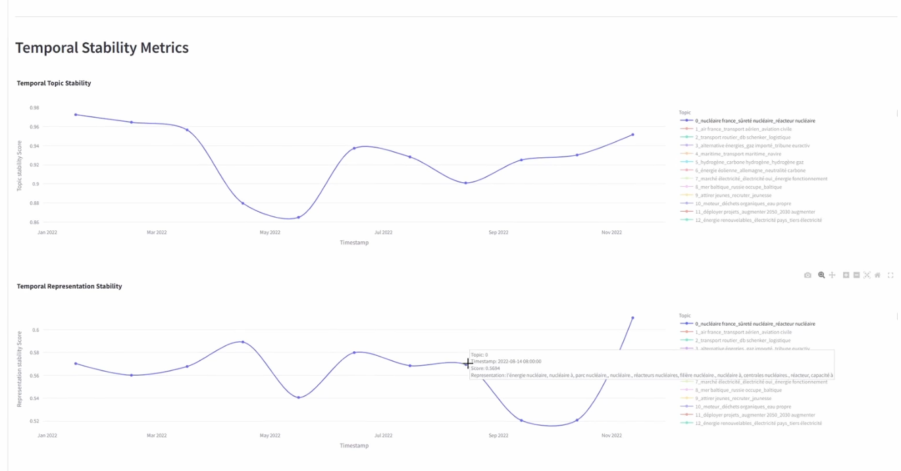
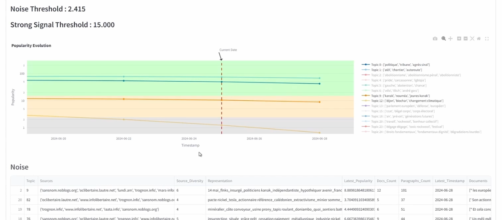

# BERTrend


## Paper

The code is this repository is part of the works described in the paper: 
[BERTrend: Neural Topic Modeling for Emerging Trends Detection](./BERTrend paper.pdf)


<!--## Badges
**TODO**
On some READMEs, you may see small images that convey metadata, such as whether or not 
all the tests are passing for the project. You can use Shields to add some to your README.
Many services also have instructions for adding a badge.
-->

## Description

BERTrend is a novel framework for detecting and monitoring weak signals in large, evolving
text corpora. It uses neural topic modeling, specifically [BERTopic](https://github.com/MaartenGr/BERTopic), in an online learning 
setting to identify and track topic evolution over time. 

**BERTrend classifies topics as 
noise, weak signals, or strong signals based on their popularity trends**, using a metric
that considers both the number of documents and update frequency. This method allows for 
real-time monitoring and analysis of emerging trends while filtering out noise.

<!--**TODO**
Let people know what your project can do specifically. Provide context and add a link to any reference visitors might be unfamiliar with. A list of Features or a Background subsection can also be added here. If there are alternatives to your project, this is a good place to list differentiating factors.
-->

## Main features

The BERTrend repository provides a set of metrics, methods and visualization tools to support the 
analysis of dynamic topic modelling in large text corpora. The tools provided are designed to 
help users detect, analyze, and visualize emerging topics and trends over time.

More specifically, the code base is divided into two main demonstrators:
- dynamic topic modelling analysis
- weak signals analysis

### Dynamic topic modelling analysis

- `bertrend/topic_analysis`: Focuses on **dynamic topic modelling** analysis using
  - dedicated metrics, called TEMPTopic
      * Stability Evaluation: Measures the stability of topics over time, evaluating how consistent and coherent topics remain.
      * Volatility Assessment: Analyzes the volatility of topics, identifying how much topics change over different time periods.
      * Two Perspectives:
        * Temporal Topic Embedding Stability: Evaluates the stability of topic embeddings over time.
        * Temporal Topic Representation Stability: Assesses the stability of topic representations over time.
  - visualization tools to assess easily the results


#### Demonstrator video
[](./docs/videos/TEMPTopic.mp4)

#### Demonstrator features
- data management: selection of single / multiple datasets, filter by time, filter by size, split long document by paragraphs 
- customization of BERTopic parameters
- exploration of topics by source, generate topic summaries using specific sources
- generate and customize newsletters by applying LLMs on BERTopic's output topics
- visualize and explore topics via different types of interactive figures (topics treemap, data maps)
- explore the evolution of topics in a temporal semantic space
- explore the stability of topics measured by TEMPTopic

### Weak signal analysis


- `bertrend/weak_signals`: 


#### Demonstrator video
[](./docs/videos/BERTrend.mp4)


#### Demonstrator features
- exploration of signals in real time at any given timestamp
- categorization of signals into three different dataframes: noise, weak and strong signals
  (each dataframe contains useful information about the signals)
- interpretation of these signals using LLMs
- inspection of topic merging process using Sankey diagram


## Visuals
**TODO**
Depending on what you are making, it can be a good idea to include screenshots or even a video (you'll frequently see GIFs rather than actual videos). Tools like ttygif can help, but check out Asciinema for a more sophisticated method.

## Installation

### Environment variables

In order to work properly, BERTrend requires the following environment variables to be set:

- `BERTREND_BASE_DIR`: this is the home dir for BERTrend data, models and logs
- openAI variables: for some features (interpretation of identified signals), BERTrend requests the access to a LLM. The LLM can be self-hosted or can belong to a cloud or be available through a 3rd-party provider. In any case we assume that it is available through the openai API. If you wish to deploy a LLM on your infrastructure, we recommend to use VLLM (https://github.com/vllm-project/vllm) to do so. In all cases, the following environment shall be set:
  - `OPENAI_API_KEY`: shall contain the key associated to your LLM deployment
  - `OPENAI_ENDPOINT`: can be empty if you use the openAI services, otherwise shall point to your LLM endpoint (for ex. Azure or local server)
  - `OPENAI_DEFAULT_MODEL_NAME`: name of the model to be used by default

### Package installation

Installation can be done using pip in the home dir of BERTrend:

`pip install .`

(or `pip install -e .` if you want to install the package locally)


### Datasets
#### Dataset sources
The BERTrend demonstrators and functions require text datasets as inputs.
Examples of meaningful datasets for BERTrend include:
- scientific publications
- news articles
- social media publications

or any combination of those.

Typical relevant public datasets:
- New York Times dataset
- Arxiv dataset

In addition, we provide some tools to collect data and generate a custom dataset.
Please refer to the documentation page about [data providers](./docs/data_provider.md)
for details.

#### Dataset format
BERTrend requires a text dataset that contains at least the following columns:
- `text`
- `timestamp`

BERTrend supports several dataset formats:
- d
- d

## Quick start

### Dynamic topic modelling analysis

### Weak signal analysis


Within a particular ecosystem, there may be a common way of installing things, such as using Yarn, NuGet, or Homebrew. However, consider the possibility that whoever is reading your README is a novice and would like more guidance. Listing specific steps helps remove ambiguity and gets people to using your project as quickly as possible. If it only runs in a specific context like a particular programming language version or operating system or has dependencies that have to be installed manually, also add a Requirements subsection.


## Usage
**TODO**
Use examples liberally, and show the expected output if you can. It's helpful to have inline the smallest example of usage that you can demonstrate, while providing links to more sophisticated examples if they are too long to reasonably include in the README.

### Getting started

## Support

Please use the 'Issues' to report and discuss any problem you are facing with BERTrend.


## Contributing
We welcome contributions from everyone. They can take the form of pull requests for smaller changed. In case of a major change (or if you have a doubt on what is "a small change"), please open an issue first to discuss what you would like to change.

To contribute to this code, you need to:
- fork the repository located at https://github.com/rte-france/BERTrend
- synch your fork with the latest developement branch of BERTrend
- implement your functionality / code, your modifications or anything else
- make sure to add tests and documentation if applicable
- once it is developed, synch your repo with the last development branch again (see point 2 above) and make sure to solve any possible conflicts
- write a pull request and make sure to target the right branch

Before implementing any major feature, please write a github issue first.

## Authors and acknowledgment

This work is the result of the work of serveral people.
See [AUTHORS](./AUTHORS.txt) for the full list of contributors.


## License information
Copyright 2023-2025 RTE France RTE: http://www.rte-france.com

This Source Code is subject to the terms of the Mozilla Public License (MPL) v2 also available here: https://www.mozilla.org/en-US/MPL/2.0/

## Citation

If you use BERTrend in one of your work, please cite:

```
@inproceedings{bertrend,
    author = { Allaa Boutaleb, Jérôme Picault, Guillaume Grosjean },
    title = { BERTrend: Neural Topic Modeling for Emerging Trends Detection },
    year = {2024},
    booktitle = {FuturED 2024: Workshop on Future of Event Detection, colocated with EMNLP 2024}, 
}
```


