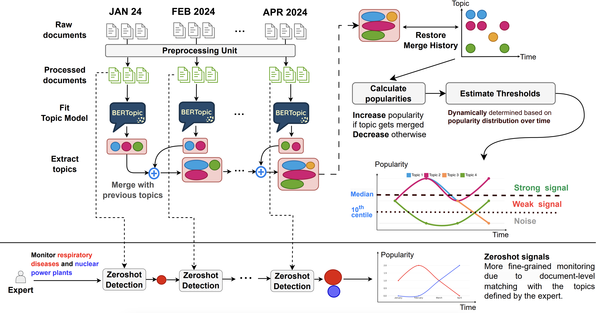
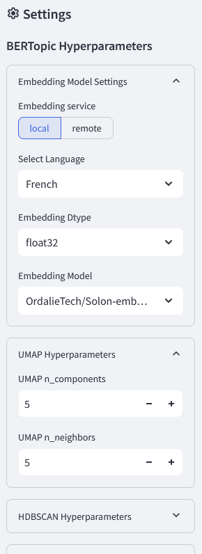
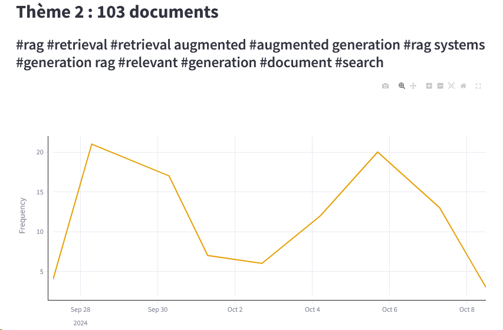
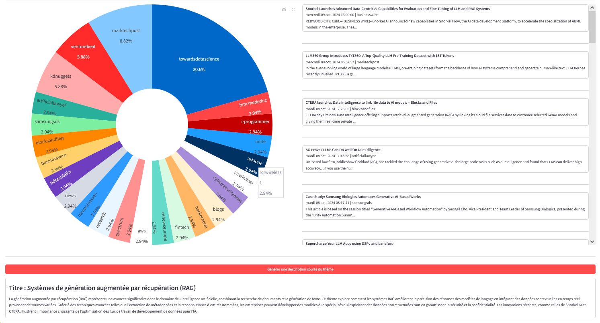
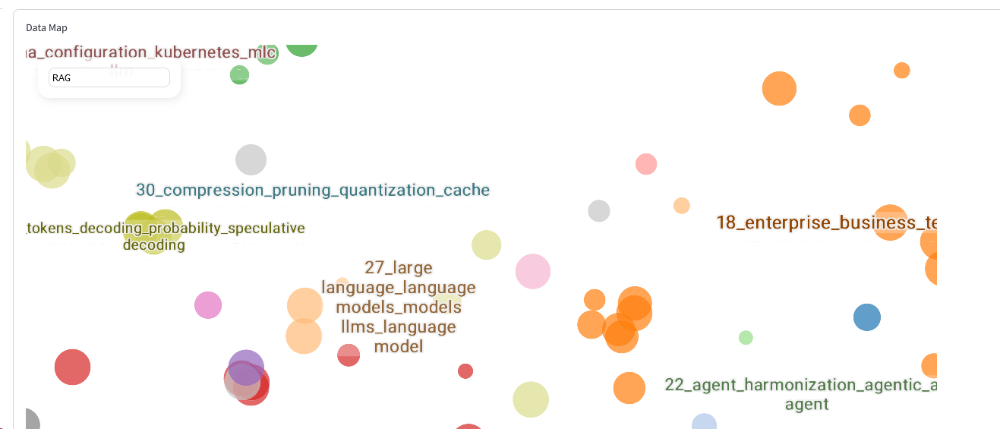
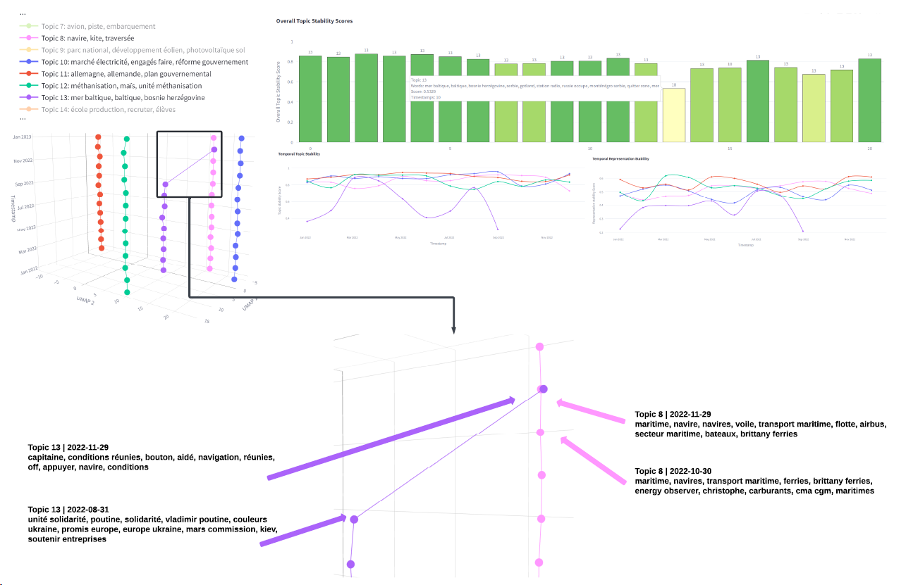
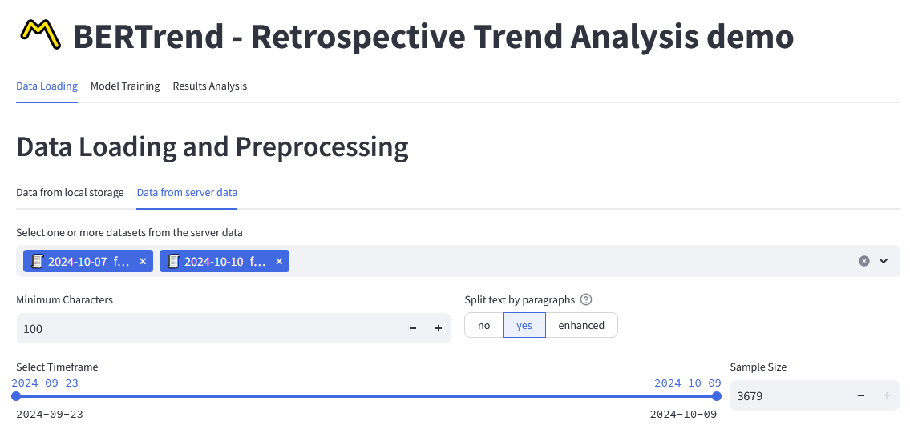
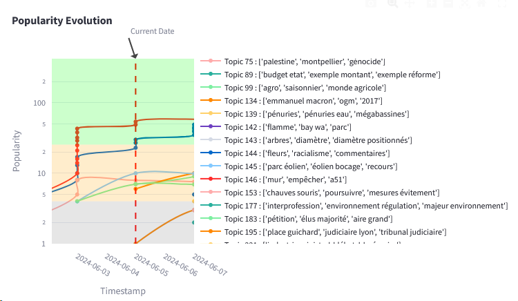
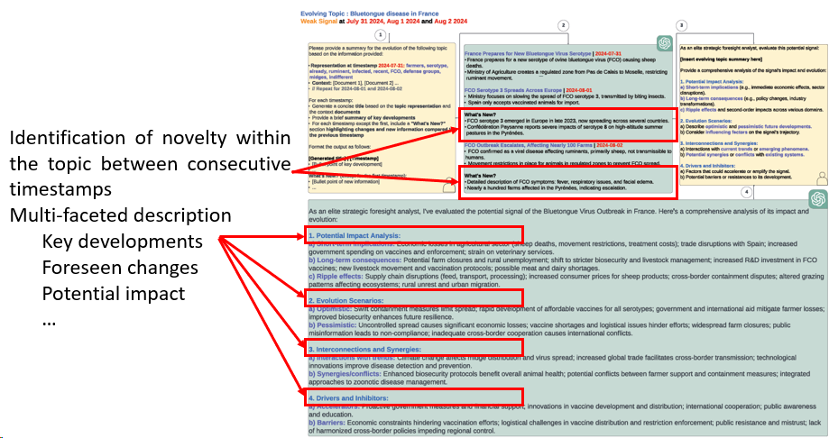

# BERTrend

[](https://github.com/rte-france/BERTrend "Go to GitHub repo")
[](https://github.com/rte-france/BERTrend)
[](https://github.com/rte-france/BERTrend)
[](https://github.com/rte-france/BERTrend/issues)
[](https://pepy.tech/project/bertrend)
[](https://pypi.org/project/bertrend/)
[](https://pypi.org/project/bertrend/)




## Paper

The code in this repository is part of the work described in the paper: 
[BERTrend: Neural Topic Modeling for Emerging Trends Detection](./BERTrend%20paper.pdf).

## Description

BERTrend is a novel framework for detecting and monitoring weak signals in large, evolving text corpora. It uses neural topic modeling, specifically [BERTopic](https://github.com/MaartenGr/BERTopic), in an online learning setting to identify and track topic evolution over time. 

BERTrend classifies topics as noise, weak signals, or strong signals based on their popularity trends, using a metric that considers both the number of documents and update frequency. This method allows for real-time monitoring and analysis of emerging trends while filtering out noise.


## Main Features

The BERTrend repository provides a set of metrics, methods, and visualization tools to support the analysis of dynamic topic modeling in large text corpora. The tools are designed to help users detect, analyze, and visualize emerging topics and trends over time.

The code base is illustrated via two main demos:

### Dynamic Topic Modeling Analysis

- [bertrend/demos/topic_analysis](bertrend/demos/topic_analysis): Focuses on dynamic topic modeling analysis using:
  - Dedicated metrics, called TEMPTopic:
    - Stability Evaluation: Measures the stability of topics over time, evaluating how consistent and coherent topics remain.
    - Volatility Assessment: Analyzes the volatility of topics, identifying how much topics change over different time periods.
    - Two Perspectives:
      - Temporal Topic Embedding Stability: Evaluates the stability of topic embeddings over time.
      - Temporal Topic Representation Stability: Assesses the stability of topic representations over time.
  - Visualization tools to easily assess the results.

####  Topic Modeling Analysis Demonstrator Video
https://github.com/user-attachments/assets/f600f666-a6da-40be-8b07-5041b3bde1dc

#### Demonstrator Features
- Data management: selection of single/multiple datasets, filter by time, filter by size, split long documents by paragraphs 
- Customization of BERTopic parameters
- Exploration of topics by source, generate topic summaries using specific sources
- Generate and customize newsletters by applying LLMs on BERTopic's output topics
- Visualize and explore topics via different types of interactive figures (topics treemap, data maps)
- Explore the evolution of topics in a temporal semantic space
- Explore the stability of topics measured by TEMPTopic

### Weak Signal Analysis

- [bertrend/demos/weak_signals](bertrend/demos/weak_signals): Identifies and analyzes emerging trends and signals

#### Weak Signal Analysis Demonstrator Video
https://github.com/user-attachments/assets/d79368d9-d4e0-4324-8a98-a888f0ab3b65


#### Demonstrator Features
- Exploration of signals in real time at any given timestamp
- Categorization of signals into three different dataframes: noise, weak and strong signals
  (each dataframe contains useful information about the signals)
- Interpretation of these signals using LLMs
- Inspection of the topic merging process using Sankey diagram

## Installation

### Environment Variables

BERTrend requires the following environment variables to be set:

- `BERTREND_BASE_DIR`: the home directory for BERTrend data, models, and logs
- OpenAI variables (for LLM integration):
  - `OPENAI_API_KEY`: the API key for your LLM deployment
  - `OPENAI_ENDPOINT`: the endpoint for your LLM deployment (empty if using OpenAI services)
  - `OPENAI_DEFAULT_MODEL_NAME`: the name of the default LLM model to use

### Hardware and Software Requirements

- Recommended: at least one GPU with 16GB RAM for faster processing
- Python >= 3.12 is required

### Package Installation

- (Recommended): create a new python environment using `venv` or `conda`: 

  `python -m venv <path>/bertrend`


- Installation from pypi

  `pip install bertrend` 


- Install using pip or poetry in the BERTrend home directory:

  ```bash
  # Basic installation with core dependencies
  pip install .  # or poetry install

    # Installation with apps dependencies
  pip install ".[apps]"  # or poetry install --extras apps

  ```

- (Use `pip install -e .` for a local installation)

NB. Due to the number of dependencies, the installation may take some time on an empty environment.

### Dependency Management

BERTrend's dependencies are organized into logical groups for easier management:

- **Core dependencies**: Essential packages for topic modeling and analysis
- **NLP and text processing**: Libraries for natural language processing tasks
- **LLM integration**: Components for working with large language models
- **Visualization and UI**: Tools for data visualization and user interfaces
- **Utilities**: General utility libraries

Optional dependency groups:

- **test**: Dependencies for running tests and measuring code coverage
- **apps**: Additional dependencies required for BERTrend applications

This organization simplifies installation and maintenance, allowing users to install only the dependencies they need for their specific use case.

### Verifying Installation

To verify that your installation is working correctly, you can run the installation verification script:

```bash
python -m bertrend.tests.test_installation
```

This script will check that all dependencies are installed correctly and provide a summary of the installation status. If any dependencies are missing, the script will provide instructions on how to install them.

### Datasets

#### Dataset Sources
BERTrend can work with various text datasets such as:
- Scientific publications
- News articles
- Social media publications

Recommended public datasets:
- New York Times dataset: https://www.kaggle.com/datasets/aryansingh0909/nyt-articles-21m-2000-present
- Arxiv dataset: https://www.kaggle.com/datasets/Cornell-University/arxiv

For custom dataset creation, please refer to the documentation page about [data providers](./docs/data_provider.md).


In order to use the provided demos, datasets :
- can be stored on the server in: `$BERTREND_BASE_DIR/data/bertrend/`
- or can be uploaded from the client device on which are displayed the Streamlit apps.

#### Dataset Format
Required columns:
- `text`
- `timestamp`

Supported formats:
- csv
- xlsx
- parquet
- json/jsonl

## Quick Start

### 1. Dynamic Topic Modeling Analysis

#### Launch the Demonstrator
```bash
cd bertrend/demos/topic_analysis
CUDA_VISIBLE_DEVICES=<gpu_number> streamlit run app.py
```

#### Description of Main Pages
- `Parameters`: Include all BERTopic parameters. Choose the embedding model carefully based on your data language.
The embedding model can run locally (a GPU is recommended); it is also possible to use a remote embedding service.

We recommend using a remote embedding service (this is now the default config) as it simplifies the computing.

The change of configuration can be done in: [services_default_config.toml](bertrend/config/services_default_config.toml).

An example of a very simple implementation to deploy a separate embedding service can be found here: https://github.com/rte-france/wattelse/tree/main/wattelse/api/embedding. (this implementation is compatible with our code)




Please refer to the [BERTopic documentation](https://maartengr.github.io/BERTopic/algorithm/algorithm.html) for parameter details.

The application is split into several pages:

- `Data loading & model training`: Allows to 
  - Select a dataset
  - Select the range of timestamps
  - Split paragraphs if needed
  - Train a topic model


- `Topic exploration`
  - Computes topics over time
  

  - Allow selecting sources and generating short descriptions for each theme
  

- `Topic visualization`: Several visualization types available:
  - `Overall Results`: Standard information such as inter-topic distance map
  - `Topics Treemap`: Block view of topics and their relative importance
  - `Data Map`: Easy topic and data search interface

    

- `Temporal Visualization`: Focus on dynamic topic modeling:
  - 3D visualization of temporal topic evolution
  - Metrics to assess topic stability over time
  - Overall topic stability, temporal topic stability, and temporal representation stability

    

- `Generate Newsletters`
  - This is an example of an application combining topic analysis and LLMs
  - Generates newsletters based on prominent topics
  - Uses LLMs to generate topic descriptions and summarize representative documents


### 2. Weak Signal Analysis
**Weak signals** refer to early, small indicators of larger, important trends (like disruptive technologies or public health issues).

Identifying weak signals early is critical for decision-making across domains such as politics, healthcare, and innovation

Key Features of the demonstrator:
- Dynamic Topic Modeling in an online learning setting
- Popularity-based Signal Classification
  * based on their popularity trends: noise, weak signals, and strong signals
  * **new popularity metric** considers both the number of documents within a topic and the **frequency of updates**


#### Launch the Weak Signal Analysis Demonstrator
```bash
cd bertrend/demos/weak_signals
CUDA_VISIBLE_DEVICES=<gpu_number> streamlit run app.py
```

#### Data Preparation
- Choose from available datasets

- Click on `Embed Documents`

#### Train Model
- Select the `Model Training` tab
- Choose time granularity (in days)
- Click `Train Models` to generate topic models per time slice
- Click `Merge Models` for the aggregated model

#### Results Analysis
Provides various statistics about topics:
- Number of topics detected
- Topic size evolution
- Topic popularity evolution
- Overall popularity evolution



- Lists of noise, weak, and strong signals

#### LLM-based signal interpretation
- As topics are hard to interprete by humans, we showcase how it can be
done using LLMs.
- Choose a specific topic and click on the button to generate an interpretation
- LLM-based in-depth signal analysis is done using predefined templates, for example:
  - describe what's happened since the last timestamp (summary of main events)
  - present through a multi-faceted description info about key developments, foreseen changes, potential impact, etc.




## Support

Please use the 'Issues' section to report and discuss any problems with BERTrend.

## Contributing

We welcome contributions. For major changes, please open an issue first to discuss your proposal.

To contribute:
1. Fork the repository at https://github.com/rte-france/BERTrend
2. Sync your fork with the latest development branch
3. Implement your changes
4. Add tests and documentation if applicable
5. Sync with the latest development branch again
6. Submit a pull request targeting the appropriate branch

## Authors and Acknowledgment

See [AUTHORS](./AUTHORS.txt) for the full list of contributors.

## License Information

Copyright 2023–2025 RTE France RTE: http://www.rte-france.com

This Source Code is subject to the terms of the Mozilla Public License (MPL) v2 also available here: https://www.mozilla.org/en-US/MPL/2.0/

## Citation

If you use BERTrend in your work, please cite:

```bibtex
@inproceedings{boutaleb-etal-2024-bertrend,
    title = "{BERT}rend: Neural Topic Modeling for Emerging Trends Detection",
    author = "Boutaleb, Allaa  and
      Picault, Jerome  and
      Grosjean, Guillaume",
    editor = "Tetreault, Joel  and
      Nguyen, Thien Huu  and
      Lamba, Hemank  and
      Hughes, Amanda",
    booktitle = "Proceedings of the Workshop on the Future of Event Detection (FuturED)",
    month = nov,
    year = "2024",
    address = "Miami, Florida, USA",
    publisher = "Association for Computational Linguistics",
    url = "https://aclanthology.org/2024.futured-1.1",
    pages = "1--17",
}

```
