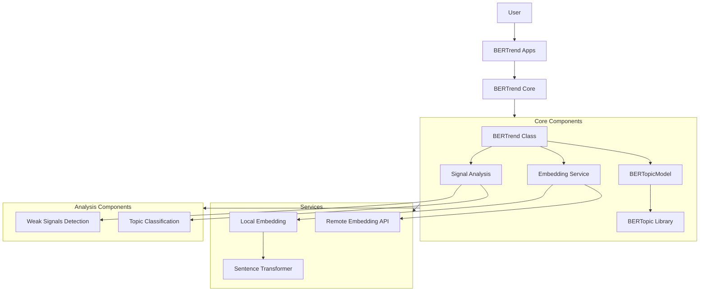
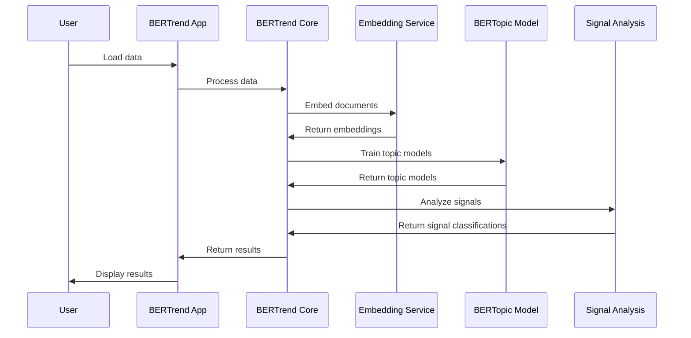
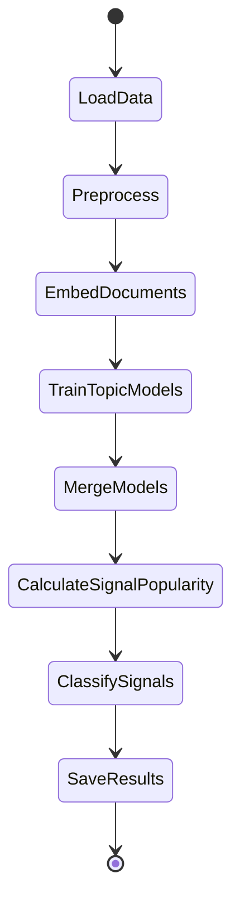
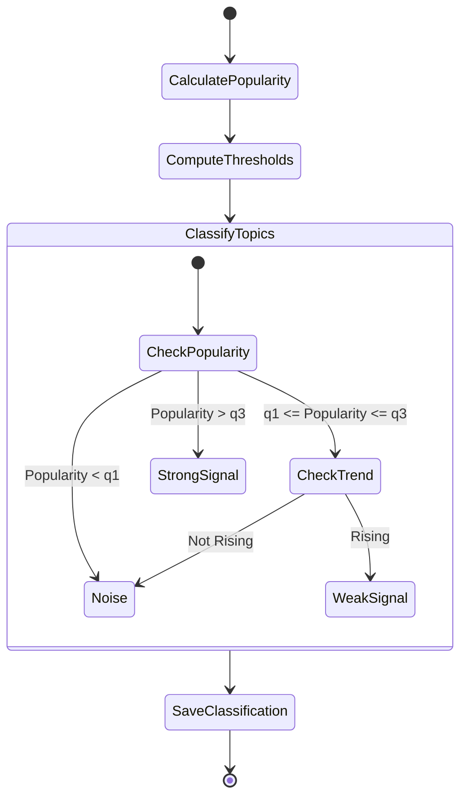
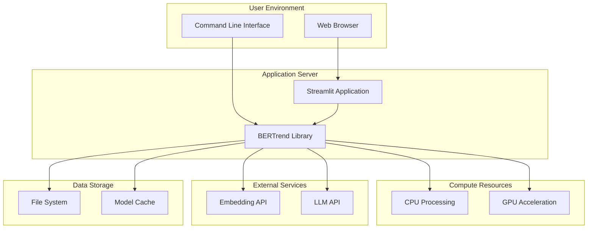
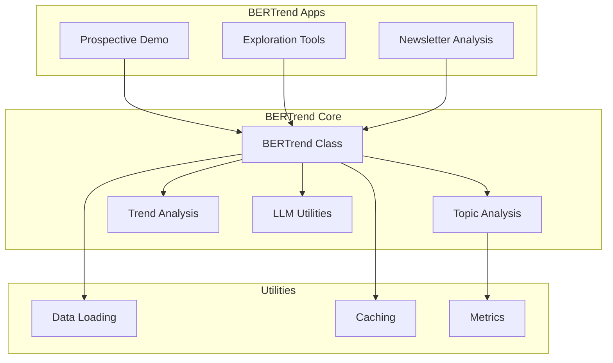

# BERTrend Architecture Documentation

This document provides architectural diagrams for the BERTrend system, showing the main components and their interactions.

## System Architecture



## Component Interactions



## Data Flow

```mermaid
flowchart TD
    RawData[Raw Text Data] --> Preprocessing[Preprocessing]
    Preprocessing --> Embedding[Document Embedding]
    Embedding --> TopicModeling[Topic Modeling]
    TopicModeling --> TopicMerging[Topic Merging]
    TopicMerging --> SignalAnalysis[Signal Analysis]
    SignalAnalysis --> Classification[Signal Classification]
    Classification --> Visualization[Visualization]

    subgraph DataTypes[Data Types]
        RawData --> |Text Documents| Preprocessing
        Preprocessing --> |Cleaned Text| Embedding
        Embedding --> |Document Vectors| TopicModeling
        TopicModeling --> |Topic Models| TopicMerging
        TopicMerging --> |Merged Topics| SignalAnalysis
        SignalAnalysis --> |Signal Trends| Classification
        Classification --> |Classified Signals| Visualization
    end
```



## Class Diagram

```mermaid
classDiagram
    class BERTrend {
        +train_topic_models()
        +merge_models_with()
        +calculate_signal_popularity()
        +classify_signals()
        +save_model()
        +restore_model()
    }

    class BERTopicModel {
        +fit()
        +get_default_config()
    }

    class EmbeddingService {
        +embed()
        -_local_embed_documents()
        -_remote_embed_documents()
    }

    BERTrend --> BERTopicModel : uses
    BERTrend --> EmbeddingService : uses
    BERTopicModel --> "BERTopic Library" : wraps
    EmbeddingService --> "SentenceTransformer" : uses
```

## Process Diagram: Topic Model Training



## Process Diagram: Signal Classification



## Deployment Architecture



## Module Dependencies


