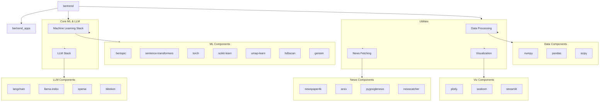

# Code dependencies

```mermaid
graph TD
    bertrend[bertrend]
    bertrend_apps[bertrend_apps]

    bertrend --> bertrend_apps

    subgraph Core[Core ML & LLM]
        direction TB
        ML[Machine Learning Stack]
        LLM[LLM Stack]
    end

    subgraph MLDetails[ML Components]
        direction TB
        bertopic[bertopic]
        transformers[sentence-transformers]
        torch[torch]
        sklearn[scikit-learn]
        umap[umap-learn]
        hdbscan[hdbscan]
        gensim[gensim]
    end

    subgraph LLMDetails[LLM Components]
        direction TB
        langchain[langchain]
        llama[llama-index]
        openai[openai]
        tiktoken[tiktoken]
    end

    subgraph Utils[Utilities]
        direction TB
        Data[Data Processing]
        News[News Fetching]
        Viz[Visualization]
    end

    subgraph DataDetails[Data Components]
        direction TB
        numpy[numpy]
        pandas[pandas]
        scipy[scipy]
    end

    subgraph NewsDetails[News Components]
        direction TB
        newspaper[newspaper4k]
        arxiv[arxiv]
        googlenews[pygooglenews]
        newscatcher[newscatcher]
    end

    subgraph VizDetails[Viz Components]
        direction TB
        plotly[plotly]
        seaborn[seaborn]
        streamlit[streamlit]
    end

    bertrend --> Core
    bertrend --> Utils

    Core --> ML
    Core --> LLM

    ML --> MLDetails
    LLM --> LLMDetails

    Utils --> Data
    Utils --> News
    Utils --> Viz

    Data --> DataDetails
    News --> NewsDetails
    Viz --> VizDetails
```