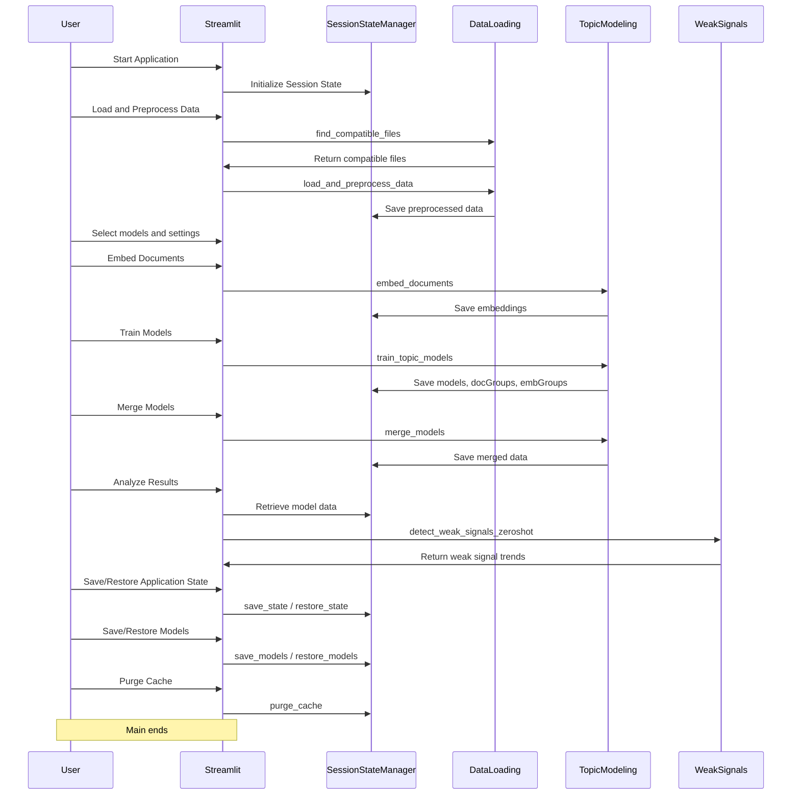
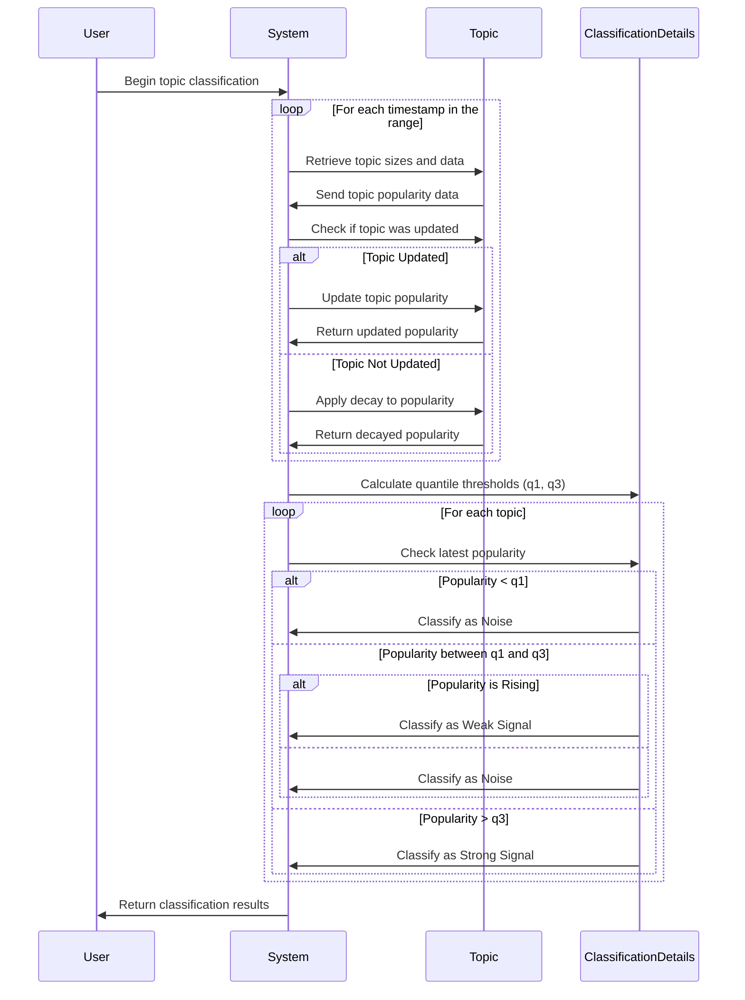
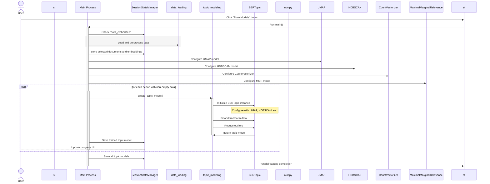
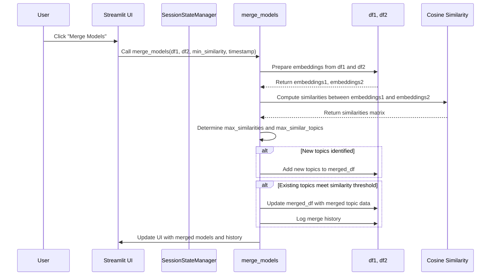
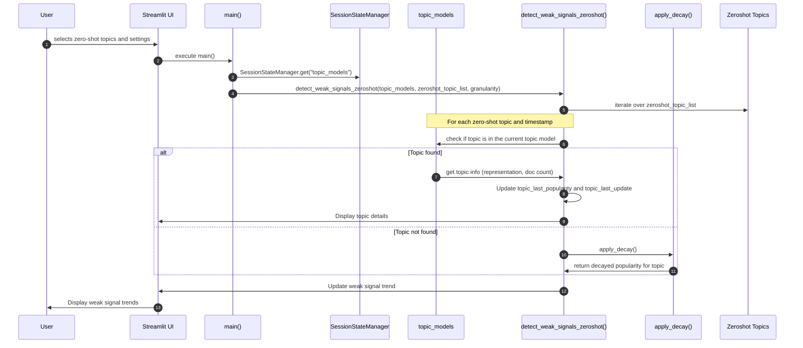

# BERTrend data flows

# General flow

```mermaid
sequenceDiagram
    participant User
    participant Streamlit
    participant SessionStateManager
    participant DataLoading
    participant TopicModeling
    participant WeakSignals

    User->>Streamlit: Start Application
    Streamlit->>SessionStateManager: Initialize Session State
    
    User->>Streamlit: Load and Preprocess Data
    Streamlit->>DataLoading: find_compatible_files
    DataLoading->>Streamlit: Return compatible files
    Streamlit->>DataLoading: load_and_preprocess_data
    DataLoading->>SessionStateManager: Save preprocessed data

    User->>Streamlit: Select models and settings
    User->>Streamlit: Embed Documents
    Streamlit->>TopicModeling: embed_documents
    TopicModeling->>SessionStateManager: Save embeddings
    
    User->>Streamlit: Train Models
    Streamlit->>TopicModeling: train_topic_models
    TopicModeling->>SessionStateManager: Save models, docGroups, embGroups

    User->>Streamlit: Merge Models
    Streamlit->>TopicModeling: merge_models
    TopicModeling->>SessionStateManager: Save merged data

    User->>Streamlit: Analyze Results
    Streamlit->>SessionStateManager: Retrieve model data
    Streamlit->>WeakSignals: detect_weak_signals_zeroshot
    WeakSignals->>Streamlit: Return weak signal trends

    User->>Streamlit: Save/Restore Application State
    Streamlit->>SessionStateManager: save_state / restore_state

    User->>Streamlit: Save/Restore Models
    Streamlit->>SessionStateManager: save_models / restore_models

    User->>Streamlit: Purge Cache
    Streamlit->>SessionStateManager: purge_cache

    Note over User, Streamlit: Main ends
```

# Classification of topics

```mermaid
sequenceDiagram
    participant User
    participant System
    participant Topic
    participant ClassificationDetails

    User->>System: Begin topic classification
    loop For each timestamp in the range
        System->>Topic: Retrieve topic sizes and data
        Topic->>System: Send topic popularity data
        System->>Topic: Check if topic was updated
        alt Topic Updated
            System->>Topic: Update topic popularity
            Topic->>System: Return updated popularity
        else Topic Not Updated
            System->>Topic: Apply decay to popularity
            Topic->>System: Return decayed popularity
        end
    end
    System->>ClassificationDetails: Calculate quantile thresholds (q1, q3)
    loop For each topic
        System->>ClassificationDetails: Check latest popularity
        alt Popularity < q1
            ClassificationDetails->>System: Classify as Noise
        else Popularity between q1 and q3
            alt Popularity is Rising
                ClassificationDetails->>System: Classify as Weak Signal
            else
                ClassificationDetails->>System: Classify as Noise
            end
        else Popularity > q3
            ClassificationDetails->>System: Classify as Strong Signal
        end
    end
    System->>User: Return classification results

```

# Creation of BERTopic models per timestamp

```mermaid
sequenceDiagram
    actor User
    participant Streamlit as st
    participant Main as Main Process
    participant SessionState as SessionStateManager
    participant DataLoader as data_loading
    participant TopicTrainer as topic_modeling
    participant BERTopic
    participant NP as numpy
    participant UMAP
    participant HDBSCAN
    participant CountVectorizer
    participant MaximalMarginalRelevance

    User->>st: Click "Train Models" button
    st->>Main: Run main()

    activate Main
    Main->>SessionState: Check "data_embedded"
    rect rgb(245, 245, 245)
    Main->>DataLoader: Load and preprocess data
    end
    Main->>SessionState: Store selected documents and embeddings

    Main->>UMAP: Configure UMAP model
    Main->>HDBSCAN: Configure HDBSCAN model
    Main->>CountVectorizer: Configure CountVectorizer
    Main->>MaximalMarginalRelevance: Configure MMR model
    
    loop for each period with non-empty data
        activate Main
        Main->>TopicTrainer: create_topic_model()
        activate TopicTrainer
        TopicTrainer->>BERTopic: Initialize BERTopic instance
        Note over BERTopic: Configure with UMAP, HDBSCAN, etc.
        TopicTrainer->>BERTopic: Fit and transform data
        TopicTrainer->>BERTopic: Reduce outliers
        BERTopic->>TopicTrainer: Return topic model
        deactivate TopicTrainer
        
        Main->>SessionState: Save trained topic model
        SessionState-->User: Update progress UI
        deactivate Main
    end

    Main->>SessionState: Store all topic models
    Main->>st: "Model training complete!"
    deactivate Main

```

# Merging of models

```mermaid
sequenceDiagram
    participant User
    participant Streamlit as Streamlit UI
    participant SessionStateManager
    participant Function as merge_models
    participant DataFrame as df1, df2
    participant CosineSimilarity as Cosine Similarity

    User->>Streamlit: Click "Merge Models"
    Streamlit->>Function: Call merge_models(df1, df2, min_similarity, timestamp)
    Function->>DataFrame: Prepare embeddings from df1 and df2
    DataFrame-->>Function: Return embeddings1, embeddings2
    Function->>CosineSimilarity: Compute similarities between embeddings1 and embeddings2
    CosineSimilarity-->>Function: Return similarities matrix
    Function->>Function: Determine max_similarities and max_similar_topics
    alt New topics identified
        Function->>DataFrame: Add new topics to merged_df
    end
    alt Existing topics meet similarity threshold
        Function->>DataFrame: Update merged_df with merged topic data
        Function->>DataFrame: Log merge history
    end
    Function->>Streamlit: Update UI with merged models and history
```

# Zero shot topic detection

```mermaid
sequenceDiagram
    autonumber
    
    participant USER as User
    participant STREAMLIT as Streamlit UI
    participant MAIN as main()
    participant SESSION as SessionStateManager
    participant TM as topic_models
    participant WS as detect_weak_signals_zeroshot()
    participant DC as apply_decay()
    participant ZT as Zeroshot Topics
    
    USER ->> STREAMLIT: selects zero-shot topics and settings
    STREAMLIT ->> MAIN: execute main()
    MAIN ->> SESSION: SessionStateManager.get("topic_models")
    MAIN ->> WS: detect_weak_signals_zeroshot(topic_models, zeroshot_topic_list, granularity)
    
    WS ->> ZT: iterate over zeroshot_topic_list
    Note over TM,WS: For each zero-shot topic and timestamp
    WS ->> TM: check if topic is in the current topic model
    alt Topic found
        TM ->> WS: get topic info (representation, doc count)
        WS ->> WS: Update topic_last_popularity and topic_last_update
        WS ->> STREAMLIT: Display topic details
    else Topic not found
        WS ->> DC: apply_decay()
        DC ->> WS: return decayed popularity for topic
    end

    WS ->> STREAMLIT: Update weak signal trend
    STREAMLIT ->> USER: Display weak signal trends

```

